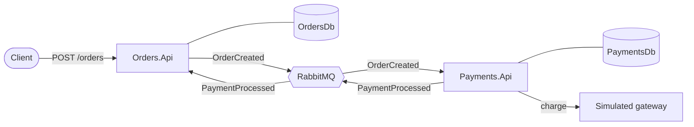

# ChaosLab.NET

[Português (Brasil)](README.pt-BR.md)

An event-driven microservices system on .NET 8. I'm building it as a lab for resilience and chaos engineering, in a deliberate order: first a solid, well-tested foundation, then the failure injection on top of it.

## What it does today

A customer places an order. `Orders.Api` accepts it immediately (`202 Accepted`) and hands the payment over to `Payments.Api` through RabbitMQ. When the payment result comes back, the order is marked as paid or failed. The two services never call each other directly, and each one owns its database.

## Architecture at a glance



## Quick start

You only need Docker with Compose.

```bash
docker compose up -d --build
```

Place an order and follow it:

```bash
curl -X POST http://localhost:5001/orders \
  -H "Content-Type: application/json" \
  -d '{"customerId":"3fa85f64-5717-4562-b3fc-2c963f66afa6","amount":149.90}'

curl http://localhost:5001/orders/<id>      # Pending, then Paid within a second or so
curl http://localhost:5002/payments/<id>
```

| Service      | URL                                      |
| ------------ | ---------------------------------------- |
| Orders.Api   | http://localhost:5001                    |
| Payments.Api | http://localhost:5002                    |
| RabbitMQ UI  | http://localhost:15672 (`chaos` / `chaos`) |
| SQL Server   | `localhost,1433` (`sa`, password in `.env`) |

The credentials in `.env` are for local development only.

## See the outbox working

```bash
docker compose stop rabbitmq
# create an order: it still returns 202 and stays Pending
docker compose start rabbitmq
# moments later the order becomes Paid, and no event was lost
```

## Project layout

```
src/
  Shared.Contracts/   integration events shared by the services
  Orders.Api/         order intake and order status
  Payments.Api/       payment processing behind a gateway abstraction
docs/                 architecture, flows, reliability, testing (EN and PT-BR)
```

## Tests

I'm working test-first from here on. The test projects are the next step, and the plan (unit, consumer and end-to-end layers, with Testcontainers) is in [docs/en/06-testing-strategy.md](docs/en/06-testing-strategy.md).

## Documentation

Start at the [documentation index](docs/README.md). The most useful entry points:

- [Architecture](docs/en/02-architecture.md)
- [Message flow and behavior scenarios](docs/en/03-message-flow.md)
- [Reliability: outbox, inbox, idempotency](docs/en/04-reliability.md)
- [Docker environment](docs/en/05-docker-environment.md)

## Roadmap

Next comes resilience (Polly, a fallback gateway, observability), then the chaos engine itself. Details in [docs/en/08-roadmap.md](docs/en/08-roadmap.md).
