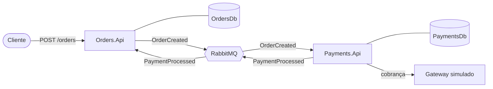

# ChaosLab.NET

[English](README.md)

Um sistema de microsserviços orientado a eventos em .NET 8. Estou construindo como um laboratório de resiliência e engenharia do caos, numa ordem deliberada: primeiro uma base sólida e bem testada, depois a injeção de falhas por cima dela.

## O que ele faz hoje

Um cliente faz um pedido. O `Orders.Api` aceita na hora (`202 Accepted`) e entrega o pagamento ao `Payments.Api` pelo RabbitMQ. Quando o resultado do pagamento volta, o pedido é marcado como pago ou como falho. Os dois serviços nunca se chamam diretamente, e cada um é dono do seu banco de dados.

## Arquitetura em resumo



## Início rápido

Você só precisa do Docker com Compose.

```bash
docker compose up -d --build
```

Faça um pedido e acompanhe:

```bash
curl -X POST http://localhost:5001/orders \
  -H "Content-Type: application/json" \
  -d '{"customerId":"3fa85f64-5717-4562-b3fc-2c963f66afa6","amount":149.90}'

curl http://localhost:5001/orders/<id>      # Pending e, em cerca de um segundo, Paid
curl http://localhost:5002/payments/<id>
```

| Serviço      | URL                                        |
| ------------ | ------------------------------------------ |
| Orders.Api   | http://localhost:5001                      |
| Payments.Api | http://localhost:5002                      |
| RabbitMQ UI  | http://localhost:15672 (`chaos` / `chaos`) |
| SQL Server   | `localhost,1433` (`sa`, senha no `.env`)   |

As credenciais do `.env` servem apenas para desenvolvimento local.

## Veja o outbox funcionando

```bash
docker compose stop rabbitmq
# crie um pedido: ele ainda retorna 202 e fica Pending
docker compose start rabbitmq
# instantes depois o pedido vira Paid, e nenhum evento se perdeu
```

## Estrutura do projeto

```
src/
  Shared.Contracts/   eventos de integração compartilhados entre os serviços
  Orders.Api/         recebimento de pedidos e consulta de status
  Payments.Api/       processamento de pagamentos atrás de uma abstração de gateway
docs/                 arquitetura, fluxos, confiabilidade, testes (EN e PT-BR)
```

## Testes

A partir daqui trabalho testes primeiro. Os projetos de teste são o próximo passo, e o plano (camadas de unidade, consumers e ponta a ponta, com Testcontainers) está em [docs/pt-BR/06-testing-strategy.md](docs/pt-BR/06-testing-strategy.md).

## Documentação

Comece pelo [índice da documentação](docs/README.md). Os pontos de entrada mais úteis:

- [Arquitetura](docs/pt-BR/02-architecture.md)
- [Fluxo de mensagens e cenários de comportamento](docs/pt-BR/03-message-flow.md)
- [Confiabilidade: outbox, inbox, idempotência](docs/pt-BR/04-reliability.md)
- [Ambiente Docker](docs/pt-BR/05-docker-environment.md)

## Roadmap

Em seguida vem a resiliência (Polly, gateway de contingência, observabilidade) e depois o motor de caos. Detalhes em [docs/pt-BR/08-roadmap.md](docs/pt-BR/08-roadmap.md).
