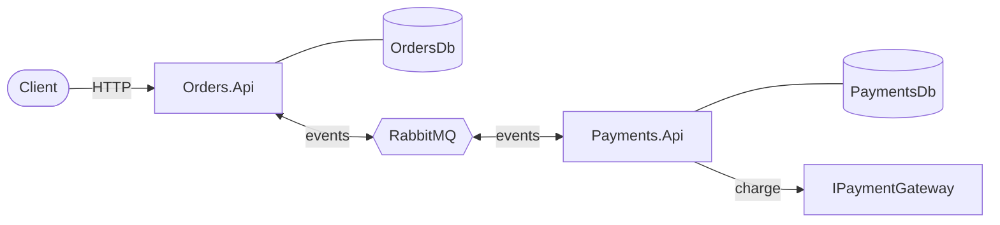

# 02 · Architecture

## The big picture

Two services, one broker, and each service with its own database. The only thing they share is a small library of event contracts.

## Services and responsibilities

| Service | Responsibility | Owns |
|---|---|---|
| `Orders.Api` | Accepts orders, tracks their status, reacts to payment results | `OrdersDb` (orders, inbox, outbox) |
| `Payments.Api` | Reacts to new orders, charges them, publishes the result | `PaymentsDb` (payments, inbox, outbox) |
| `Shared.Contracts` | Defines the integration events (`OrderCreated`, `PaymentProcessed`) | Nothing at runtime |

## Why events instead of direct calls

The first version of this idea had `Orders` calling `Payments` and waiting for the answer. I moved away from that because it ties the customer's experience to the slowest dependency: if the payment gateway takes five seconds, the customer waits five seconds.

With events, `Orders` records the order, publishes `OrderCreated` and answers right away. The payment happens in the background, and the customer sees the status change when it's done. This also makes the later chaos experiments meaningful, because the failures hit the layer where resilience really matters.

## One database per service

Each service has its own database (`OrdersDb` and `PaymentsDb`) and never reads the other's tables. There are no cross-service joins and no distributed transactions. The price is eventual consistency, which I handle with the outbox, the inbox and idempotent consumers (see [04 · Reliability](04-reliability.md)).

In local development both databases live on a single SQL Server container to keep the setup light. They are still separate databases with no shared tables. In a real deployment each would be its own instance.

## About `Shared.Contracts`

It contains only the event records and no logic. That's on purpose: a shared library can quietly turn into coupling, so I keep it to plain data. Changing an event is a change to a contract between services, and I treat it that way (additive changes first, breaking changes only with a plan).

## Technology choices

| Choice | Why |
|---|---|
| .NET 8 | LTS release, minimal APIs keep the services small |
| MassTransit 8.x | Mature messaging abstraction with built-in outbox and inbox for EF Core. I stay on the 8.x line because later major versions changed the licensing, and I'd want to re-evaluate before upgrading |
| RabbitMQ 3.13 | Simple to run locally, and the management UI helps a lot when I'm learning how messages move |
| SQL Server 2022 | Relational persistence for each service, supported by the MassTransit EF outbox |
| EF Core 8 | Persistence for the domain data and the outbox and inbox tables |

## HTTP surface

| Service | Endpoint | Behavior |
|---|---|---|
| Orders | `POST /orders` | Validates, stores the order as `Pending`, returns `202 Accepted` |
| Orders | `GET /orders/{id}` | Returns the order or `404` |
| Payments | `GET /payments/{orderId}` | Returns the payment or `404` |
| Both | `GET /health` | Returns `200 ok` |
