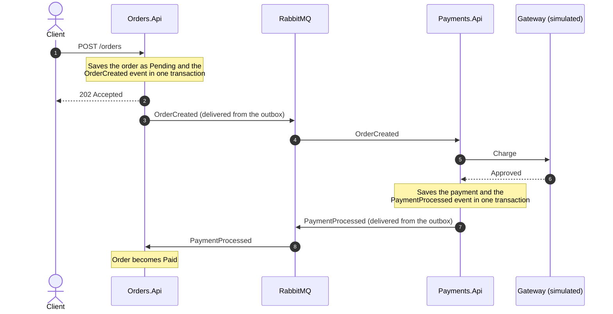
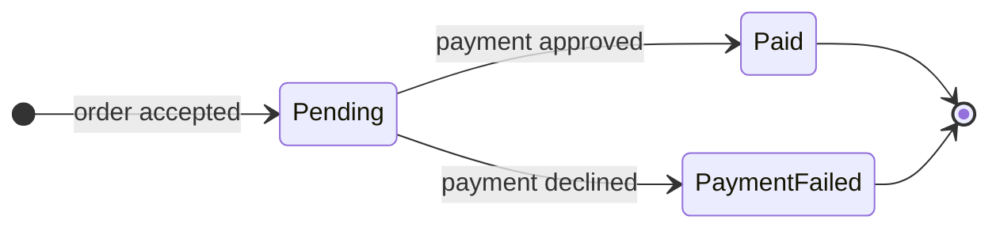

# 03 · Message flow

## The happy path

The customer gets an answer at step 3, before any payment work happens. Everything after that is background work.

## When the payment is declined

The flow is identical up to the gateway. When the gateway declines, `Payments.Api` stores the payment as `Declined` with the reason, publishes `PaymentProcessed` with `Success = false`, and `Orders.Api` moves the order to `PaymentFailed`. A decline is a normal business outcome, not an error.

## Lifecycle

`Paid` and `PaymentFailed` are final. A payment record is `Approved` or `Declined` and never changes afterward.

## Contracts

| Event | Published by | Consumed by | Fields |
|---|---|---|---|
| `OrderCreated` | Orders | Payments | `OrderId`, `CustomerId`, `Amount`, `CreatedAt` |
| `PaymentProcessed` | Payments | Orders | `OrderId`, `Success`, `Gateway`, `FailureReason?`, `ProcessedAt` |

## Messaging topology

MassTransit names things by convention. Events are published to an exchange named after the message type, and each consumer gets a queue named after itself in kebab-case (`OrderCreatedConsumer` listens on `order-created`, `PaymentProcessedConsumer` on `payment-processed`). You can see all of it in the RabbitMQ management UI.

## Behavior scenarios

This catalog is the contract between the documentation and the tests. Every scenario gets an ID, and every test will reference the ID it verifies. If a behavior isn't listed here, I add it here before I write its test.

### Orders

| ID | Scenario |
|---|---|
| ORD-01 | Given a valid request, when I create an order, then it is stored as `Pending`, `OrderCreated` is stored in the outbox in the same transaction, and the response is `202`. |
| ORD-02 | Given an amount that is zero or negative, when I create an order, then the response is `400` and nothing is stored or published. |
| ORD-03 | Given an existing order, when I fetch it, then I get `200` with its current status. |
| ORD-04 | Given an unknown id, when I fetch an order, then I get `404`. |
| ORD-05 | Given a `Pending` order, when a successful `PaymentProcessed` arrives, then the order becomes `Paid`. |
| ORD-06 | Given a `Pending` order, when a failed `PaymentProcessed` arrives, then the order becomes `PaymentFailed` and keeps the failure reason. |
| ORD-07 | Given an order that is not `Pending`, when a `PaymentProcessed` arrives, then nothing changes. |
| ORD-08 | Given an unknown order id, when a `PaymentProcessed` arrives, then it is ignored without error. |
| ORD-09 | Given the broker is unavailable, when I create an order, then the response is still `202`, and the event is delivered once the broker is back. |

### Payments

| ID | Scenario |
|---|---|
| PAY-01 | Given the gateway approves, when `OrderCreated` arrives, then the payment is stored as `Approved` and `PaymentProcessed` with `Success = true` is published. |
| PAY-02 | Given the gateway declines, when `OrderCreated` arrives, then the payment is stored as `Declined` with the reason and `PaymentProcessed` with `Success = false` is published. |
| PAY-03 | Given an order that already has a payment, when `OrderCreated` arrives again, then no new charge happens and nothing is published. |
| PAY-04 | Given the same message is delivered twice, then it is processed once. |
| PAY-05 | Given the payment and its event are being saved, when the database commit fails, then neither of them is persisted. |
| PAY-06 | Given an existing payment, when I fetch it by order id, then I get `200`. |
| PAY-07 | Given no payment for an order id, when I fetch it, then I get `404`. |

### End to end

| ID | Scenario |
|---|---|
| FLW-01 | Given a healthy system and an approving gateway, when I create an order, then it ends up `Paid`. |
| FLW-02 | Given a declining gateway, when I create an order, then it ends up `PaymentFailed`. |
| FLW-03 | Given `Payments.Api` is down, when I create an order, then it stays `Pending`, and becomes `Paid` after `Payments.Api` returns. |
