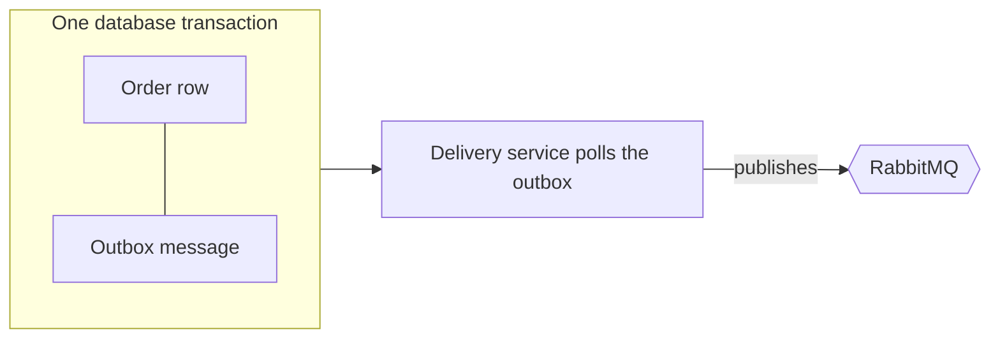

# 04 · Reliability

Messaging between services fails in boring ways: a broker restarts, a process dies halfway through, a message arrives twice. This document explains what I did about each of them in Phase 1, and what I deliberately left for later.

## The problem the outbox solves

Saving an order and publishing `OrderCreated` are two different systems, and no transaction spans both. If I save first and the publish fails, the order exists and no payment will ever happen. If I publish first and the save fails, someone gets charged for an order that doesn't exist.

## Transactional outbox

Instead of publishing directly, the service writes the event to an outbox table in the same transaction as the business data. Either both are committed or neither is. A background delivery service reads the outbox and publishes to RabbitMQ, retrying until the broker accepts the message.

Both services use it. `Orders.Api` uses the bus outbox for the `Publish` call in the endpoint. `Payments.Api` uses the consumer outbox, so the `Payment` row and the `PaymentProcessed` event are committed together.

## Inbox and idempotency

Brokers guarantee at-least-once delivery, so I have to assume duplicates. I protect against them in three layers:

1. **Inbox.** MassTransit records the ids of processed messages and drops repeats within a 30 minute window.
2. **Business check.** `OrderCreatedConsumer` looks for an existing payment for the order before charging. `PaymentProcessedConsumer` only changes orders that are still `Pending`.
3. **Unique index.** `Payment.OrderId` is unique in the database, so even a race between two consumers cannot create two payments.

## What happens when something fails

| Failure | Effect |
|---|---|
| RabbitMQ is down | `POST /orders` still returns `202`. Events wait in the outbox and are delivered when the broker returns (ORD-09) |
| `Payments.Api` is down | Orders stay `Pending`. Messages wait in the queue and are processed when it returns (FLW-03) |
| A consumer throws | MassTransit's retry and error queue rules apply. I haven't tuned them yet |
| SQL Server is down | The affected service can't write and returns errors. The outbox protects against broker failures, not database ones. Handling this gracefully is part of Phase 2 and 3 |

## Ordering and consistency

I don't rely on message ordering. Each handler is safe to run on its own and on repeated input. Between the moment an order is created and the moment it's marked `Paid`, the two services disagree, and that's expected and visible to the client as `Pending`.

## Known limitation in Phase 1

`OrderCreatedConsumer` calls the gateway while the consumer's transaction is open, so a database connection is held during the charge. With the simulated gateway (100 to 300 ms) that's acceptable. With a slow gateway it becomes a real problem, and it is the first thing I'll fix in Phase 2, by moving the call outside the transaction.

There is a second, related risk. A charge is an external side effect that a database transaction can't roll back. If the charge succeeds and the commit fails, the message is redelivered and the customer could be charged again. The real protection is sending an idempotency key (the `OrderId`) to the gateway, which the Phase 2 gateway clients will do.
