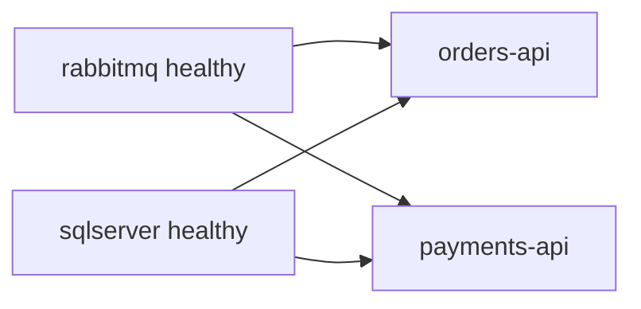

# 05 · Docker environment

Everything runs locally with Docker Compose. The only prerequisite is Docker.

## Services

| Service | Image | Ports | Notes |
|---|---|---|---|
| `rabbitmq` | `rabbitmq:3.13-management` | 5672 (AMQP), 15672 (UI) | Credentials from `.env` |
| `sqlserver` | `mssql/server:2022-latest` | 1433 | One instance, two databases, data in the `sqldata` volume |
| `orders-api` | built from `Dockerfile` | 5001 → 8080 | Uses `OrdersDb` |
| `payments-api` | built from `Dockerfile` | 5002 → 8080 | Uses `PaymentsDb`, reads `Gateway__FailureRate` |

## Startup order



RabbitMQ and SQL Server both define healthchecks, and the two APIs wait for them with `condition: service_healthy`. On top of that, each API retries creating its database on startup (up to 15 attempts, 3 seconds apart), because SQL Server can report healthy slightly before it accepts every kind of connection.

## One Dockerfile for both services

The `Dockerfile` is a multi-stage build parameterized by `PROJECT`. Compose passes `Orders.Api` or `Payments.Api`, and the same file builds either one. The final image is the ASP.NET runtime image, listening on port 8080.

## Configuration

Settings arrive as environment variables, using ASP.NET Core's double underscore convention:

| Variable | Purpose |
|---|---|
| `ConnectionStrings__Db` | The service's SQL Server connection string |
| `RabbitMq__Host`, `RabbitMq__User`, `RabbitMq__Password` | Broker connection |
| `Gateway__FailureRate` | Payments only. Probability (0 to 1) that the simulated gateway declines a charge |

`.env` holds `SA_PASSWORD`, `RABBIT_USER` and `RABBIT_PASS`. These are development credentials and must never be reused elsewhere.

## Everyday commands

```bash
docker compose up -d --build     # start everything
docker compose logs -f payments-api
docker compose stop rabbitmq     # simulate a broker outage
docker compose down              # stop, keep data
docker compose down -v           # stop and wipe the databases
```

## Running the apps outside Docker

Start only the infrastructure and run the services with the .NET SDK. The defaults in `appsettings.json` point at `localhost`.

```bash
docker compose up -d rabbitmq sqlserver
dotnet run --project src/Orders.Api --urls http://localhost:5001
dotnet run --project src/Payments.Api --urls http://localhost:5002
```

## Troubleshooting

- **A service keeps restarting at first boot.** SQL Server takes a while on a cold start. Give it a minute and check `docker compose logs sqlserver`.
- **Port already in use.** Change the left side of the port mapping in `docker-compose.yml`.
- **Strange data from a previous run.** `docker compose down -v` gives you a clean slate.
