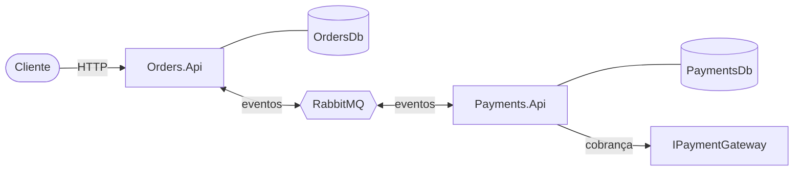

# 02 · Arquitetura

## Visão geral

Dois serviços, um broker e cada serviço com o seu próprio banco. A única coisa que eles compartilham é uma pequena biblioteca de contratos de eventos.

## Serviços e responsabilidades

| Serviço | Responsabilidade | É dono de |
|---|---|---|
| `Orders.Api` | Recebe pedidos, acompanha o status, reage aos resultados de pagamento | `OrdersDb` (pedidos, inbox, outbox) |
| `Payments.Api` | Reage a novos pedidos, cobra, publica o resultado | `PaymentsDb` (pagamentos, inbox, outbox) |
| `Shared.Contracts` | Define os eventos de integração (`OrderCreated`, `PaymentProcessed`) | Nada em tempo de execução |

## Por que eventos em vez de chamadas diretas

A primeira versão desta ideia tinha o `Orders` chamando o `Payments` e esperando a resposta. Abandonei isso porque amarra a experiência do cliente à dependência mais lenta: se o gateway de pagamento leva cinco segundos, o cliente espera cinco segundos.

Com eventos, o `Orders` registra o pedido, publica `OrderCreated` e responde na hora. O pagamento acontece em segundo plano, e o cliente vê o status mudar quando termina. Isso também dá sentido aos experimentos de caos que virão, porque as falhas atingem a camada em que a resiliência realmente importa.

## Um banco por serviço

Cada serviço tem seu próprio banco (`OrdersDb` e `PaymentsDb`) e nunca lê as tabelas do outro. Não há joins entre serviços nem transações distribuídas. O preço é a consistência eventual, que trato com outbox, inbox e consumers idempotentes (veja [04 · Confiabilidade](04-reliability.md)).

No desenvolvimento local, os dois bancos ficam em um único container de SQL Server para manter o ambiente leve. Continuam sendo bancos separados, sem tabelas compartilhadas. Em um ambiente real, cada um seria uma instância própria.

## Sobre o `Shared.Contracts`

Ele contém apenas os records dos eventos, sem lógica. É de propósito: uma biblioteca compartilhada pode virar acoplamento sem que ninguém perceba, então eu a mantenho só com dados. Alterar um evento é alterar um contrato entre serviços, e eu trato assim (primeiro mudanças aditivas, mudanças incompatíveis apenas com um plano).

## Escolhas de tecnologia

| Escolha | Por quê |
|---|---|
| .NET 8 | Versão LTS, e as minimal APIs mantêm os serviços enxutos |
| MassTransit 8.x | Abstração de mensageria madura, com outbox e inbox prontos para EF Core. Fico na linha 8.x porque as versões maiores seguintes mudaram o licenciamento, e eu reavaliaria antes de atualizar |
| RabbitMQ 3.13 | Simples de rodar localmente, e a interface de gerenciamento ajuda muito a entender como as mensagens se movem |
| SQL Server 2022 | Persistência relacional para cada serviço, suportada pelo outbox de EF do MassTransit |
| EF Core 8 | Persistência dos dados de domínio e das tabelas de outbox e inbox |

## Superfície HTTP

| Serviço | Endpoint | Comportamento |
|---|---|---|
| Orders | `POST /orders` | Valida, grava o pedido como `Pending`, retorna `202 Accepted` |
| Orders | `GET /orders/{id}` | Retorna o pedido ou `404` |
| Payments | `GET /payments/{orderId}` | Retorna o pagamento ou `404` |
| Ambos | `GET /health` | Retorna `200 ok` |
