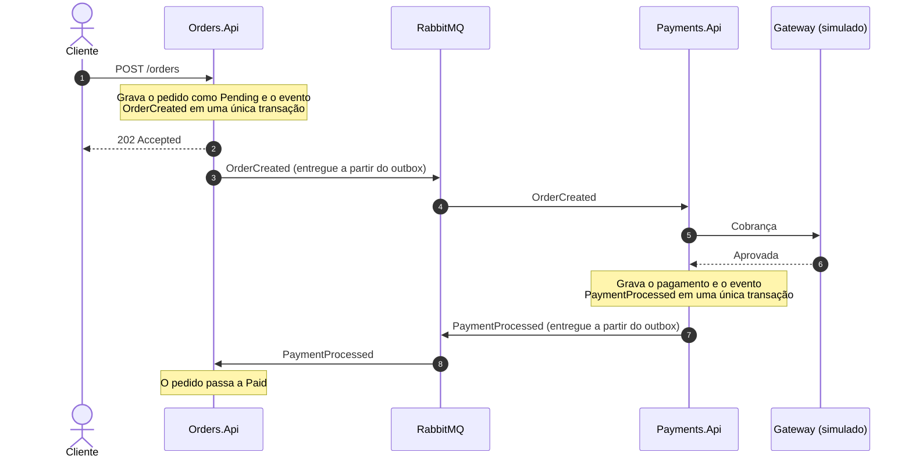
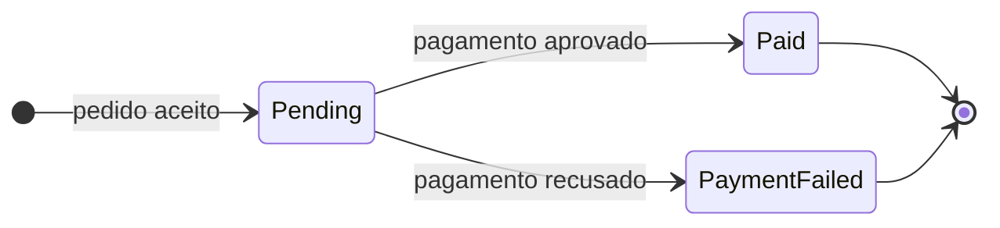

# 03 · Fluxo de mensagens

## O caminho feliz

O cliente recebe a resposta no passo 3, antes de qualquer trabalho de pagamento. Tudo o que vem depois é processamento em segundo plano.

## Quando o pagamento é recusado

O fluxo é idêntico até o gateway. Quando o gateway recusa, o `Payments.Api` grava o pagamento como `Declined` com o motivo, publica `PaymentProcessed` com `Success = false`, e o `Orders.Api` move o pedido para `PaymentFailed`. Uma recusa é um resultado de negócio normal, e não um erro.

## Ciclo de vida

`Paid` e `PaymentFailed` são estados finais. Um registro de pagamento é `Approved` ou `Declined` e não muda depois disso.

## Contratos

| Evento | Publicado por | Consumido por | Campos |
|---|---|---|---|
| `OrderCreated` | Orders | Payments | `OrderId`, `CustomerId`, `Amount`, `CreatedAt` |
| `PaymentProcessed` | Payments | Orders | `OrderId`, `Success`, `Gateway`, `FailureReason?`, `ProcessedAt` |

## Topologia de mensageria

O MassTransit nomeia as coisas por convenção. Os eventos são publicados em uma exchange com o nome do tipo da mensagem, e cada consumer ganha uma fila com o próprio nome em kebab-case (`OrderCreatedConsumer` escuta em `order-created`, `PaymentProcessedConsumer` em `payment-processed`). Dá para ver tudo isso na interface de gerenciamento do RabbitMQ.

## Cenários de comportamento

Este catálogo é o contrato entre a documentação e os testes. Cada cenário tem um ID, e cada teste vai referenciar o ID que verifica. Se um comportamento não está listado aqui, eu o adiciono aqui antes de escrever o teste.

### Orders

| ID | Cenário |
|---|---|
| ORD-01 | Dado um request válido, quando eu crio um pedido, então ele é gravado como `Pending`, o `OrderCreated` é gravado no outbox na mesma transação e a resposta é `202`. |
| ORD-02 | Dado um valor zero ou negativo, quando eu crio um pedido, então a resposta é `400` e nada é gravado nem publicado. |
| ORD-03 | Dado um pedido existente, quando eu o consulto, então recebo `200` com o status atual. |
| ORD-04 | Dado um id desconhecido, quando eu consulto um pedido, então recebo `404`. |
| ORD-05 | Dado um pedido `Pending`, quando chega um `PaymentProcessed` com sucesso, então o pedido passa a `Paid`. |
| ORD-06 | Dado um pedido `Pending`, quando chega um `PaymentProcessed` com falha, então o pedido passa a `PaymentFailed` e guarda o motivo. |
| ORD-07 | Dado um pedido que não está `Pending`, quando chega um `PaymentProcessed`, então nada muda. |
| ORD-08 | Dado um id de pedido desconhecido, quando chega um `PaymentProcessed`, então ele é ignorado sem erro. |
| ORD-09 | Dado que o broker está indisponível, quando eu crio um pedido, então a resposta continua sendo `202`, e o evento é entregue quando o broker volta. |

### Payments

| ID | Cenário |
|---|---|
| PAY-01 | Dado que o gateway aprova, quando chega um `OrderCreated`, então o pagamento é gravado como `Approved` e um `PaymentProcessed` com `Success = true` é publicado. |
| PAY-02 | Dado que o gateway recusa, quando chega um `OrderCreated`, então o pagamento é gravado como `Declined` com o motivo e um `PaymentProcessed` com `Success = false` é publicado. |
| PAY-03 | Dado um pedido que já tem pagamento, quando chega outro `OrderCreated` para ele, então não há nova cobrança e nada é publicado. |
| PAY-04 | Dado que a mesma mensagem é entregue duas vezes, então ela é processada uma só vez. |
| PAY-05 | Dado que o pagamento e o seu evento estão sendo gravados, quando o commit no banco falha, então nenhum dos dois é persistido. |
| PAY-06 | Dado um pagamento existente, quando eu o consulto pelo id do pedido, então recebo `200`. |
| PAY-07 | Dado que não há pagamento para um id de pedido, quando eu o consulto, então recebo `404`. |

### Ponta a ponta

| ID | Cenário |
|---|---|
| FLW-01 | Dado um sistema saudável e um gateway que aprova, quando eu crio um pedido, então ele termina como `Paid`. |
| FLW-02 | Dado um gateway que recusa, quando eu crio um pedido, então ele termina como `PaymentFailed`. |
| FLW-03 | Dado que o `Payments.Api` está fora do ar, quando eu crio um pedido, então ele fica `Pending` e passa a `Paid` depois que o `Payments.Api` volta. |
