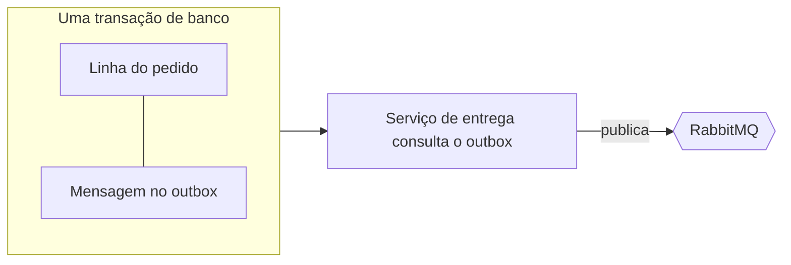

# 04 · Confiabilidade

A mensageria entre serviços falha de formas banais: um broker reinicia, um processo morre no meio do caminho, uma mensagem chega duas vezes. Este documento explica o que fiz sobre cada uma delas na Fase 1 e o que deixei deliberadamente para depois.

## O problema que o outbox resolve

Gravar um pedido e publicar o `OrderCreated` são duas operações em sistemas diferentes, e nenhuma transação abrange as duas. Se eu gravo primeiro e a publicação falha, o pedido existe e nenhum pagamento vai acontecer. Se eu publico primeiro e a gravação falha, alguém é cobrado por um pedido que não existe.

## Outbox transacional

Em vez de publicar direto, o serviço grava o evento em uma tabela de outbox, na mesma transação dos dados de negócio. Ou os dois são confirmados, ou nenhum. Um serviço de entrega em segundo plano lê o outbox e publica no RabbitMQ, tentando de novo até o broker aceitar a mensagem.

Os dois serviços usam esse mecanismo. O `Orders.Api` usa o bus outbox na chamada de `Publish` do endpoint. O `Payments.Api` usa o outbox do consumer, então a linha de `Payment` e o evento `PaymentProcessed` são confirmados juntos.

## Inbox e idempotência

Brokers garantem entrega pelo menos uma vez, então preciso assumir que haverá duplicatas. Me protejo delas em três camadas:

1. **Inbox.** O MassTransit registra os ids das mensagens processadas e descarta repetições dentro de uma janela de 30 minutos.
2. **Verificação de negócio.** O `OrderCreatedConsumer` procura um pagamento existente para o pedido antes de cobrar. O `PaymentProcessedConsumer` só altera pedidos que ainda estão `Pending`.
3. **Índice único.** `Payment.OrderId` é único no banco, então nem uma corrida entre dois consumers consegue criar dois pagamentos.

## O que acontece quando algo falha

| Falha | Efeito |
|---|---|
| RabbitMQ fora do ar | `POST /orders` continua retornando `202`. Os eventos esperam no outbox e são entregues quando o broker volta (ORD-09) |
| `Payments.Api` fora do ar | Os pedidos ficam `Pending`. As mensagens esperam na fila e são processadas quando ele volta (FLW-03) |
| Um consumer lança exceção | Valem as regras de retry e de fila de erro do MassTransit. Ainda não as ajustei |
| SQL Server fora do ar | O serviço afetado não consegue gravar e retorna erros. O outbox protege contra falhas do broker, não do banco. Tratar isso com elegância faz parte das Fases 2 e 3 |

## Ordem e consistência

Não dependo da ordem das mensagens. Cada handler é seguro ao rodar sozinho e com entradas repetidas. Entre o momento em que um pedido é criado e o momento em que é marcado como `Paid`, os dois serviços discordam, o que é esperado e aparece para o cliente como `Pending`.

## Limitação conhecida da Fase 1

O `OrderCreatedConsumer` chama o gateway enquanto a transação do consumer está aberta, então uma conexão de banco fica retida durante a cobrança. Com o gateway simulado (100 a 300 ms) isso é aceitável. Com um gateway lento vira um problema real, e é a primeira coisa que vou corrigir na Fase 2, movendo a chamada para fora da transação.

Existe um segundo risco, relacionado. Uma cobrança é um efeito colateral externo que uma transação de banco não consegue desfazer. Se a cobrança der certo e o commit falhar, a mensagem é reentregue e o cliente poderia ser cobrado de novo. A proteção de verdade é enviar uma chave de idempotência (o `OrderId`) ao gateway, o que os clientes de gateway da Fase 2 vão fazer.
