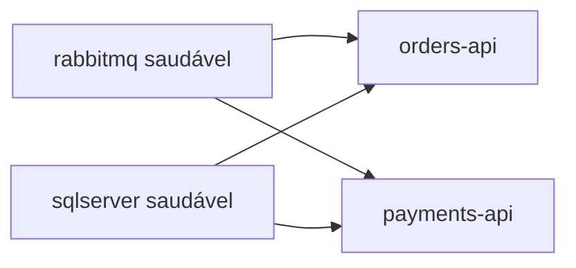

# 05 · Ambiente Docker

Tudo roda localmente com Docker Compose. O único pré-requisito é o Docker.

## Serviços

| Serviço | Imagem | Portas | Observações |
|---|---|---|---|
| `rabbitmq` | `rabbitmq:3.13-management` | 5672 (AMQP), 15672 (UI) | Credenciais vindas do `.env` |
| `sqlserver` | `mssql/server:2022-latest` | 1433 | Uma instância, dois bancos, dados no volume `sqldata` |
| `orders-api` | construída a partir do `Dockerfile` | 5001 → 8080 | Usa o `OrdersDb` |
| `payments-api` | construída a partir do `Dockerfile` | 5002 → 8080 | Usa o `PaymentsDb`, lê `Gateway__FailureRate` |

## Ordem de inicialização



RabbitMQ e SQL Server definem healthchecks, e as duas APIs esperam por eles com `condition: service_healthy`. Além disso, cada API tenta criar o próprio banco na inicialização, com novas tentativas (até 15, com 3 segundos de intervalo), porque o SQL Server pode se declarar saudável um pouco antes de aceitar todo tipo de conexão.

## Um Dockerfile para os dois serviços

O `Dockerfile` é um build multi-stage parametrizado por `PROJECT`. O Compose passa `Orders.Api` ou `Payments.Api`, e o mesmo arquivo constrói qualquer um dos dois. A imagem final é a de runtime do ASP.NET, escutando na porta 8080.

## Configuração

As configurações chegam como variáveis de ambiente, com a convenção de sublinhado duplo do ASP.NET Core:

| Variável | Finalidade |
|---|---|
| `ConnectionStrings__Db` | String de conexão do SQL Server do serviço |
| `RabbitMq__Host`, `RabbitMq__User`, `RabbitMq__Password` | Conexão com o broker |
| `Gateway__FailureRate` | Somente Payments. Probabilidade (0 a 1) de o gateway simulado recusar uma cobrança |

O `.env` guarda `SA_PASSWORD`, `RABBIT_USER` e `RABBIT_PASS`. São credenciais de desenvolvimento e nunca devem ser reutilizadas em outro lugar.

## Comandos do dia a dia

```bash
docker compose up -d --build     # sobe tudo
docker compose logs -f payments-api
docker compose stop rabbitmq     # simula uma queda do broker
docker compose down              # para, mantém os dados
docker compose down -v           # para e apaga os bancos
```

## Rodando as aplicações fora do Docker

Suba apenas a infraestrutura e rode os serviços com o SDK do .NET. Os valores padrão do `appsettings.json` apontam para `localhost`.

```bash
docker compose up -d rabbitmq sqlserver
dotnet run --project src/Orders.Api --urls http://localhost:5001
dotnet run --project src/Payments.Api --urls http://localhost:5002
```

## Solução de problemas

- **Um serviço fica reiniciando na primeira subida.** O SQL Server demora em um cold start. Dê um minuto e confira `docker compose logs sqlserver`.
- **Porta já em uso.** Altere o lado esquerdo do mapeamento de portas no `docker-compose.yml`.
- **Dados estranhos de uma execução anterior.** `docker compose down -v` devolve um ambiente limpo.
